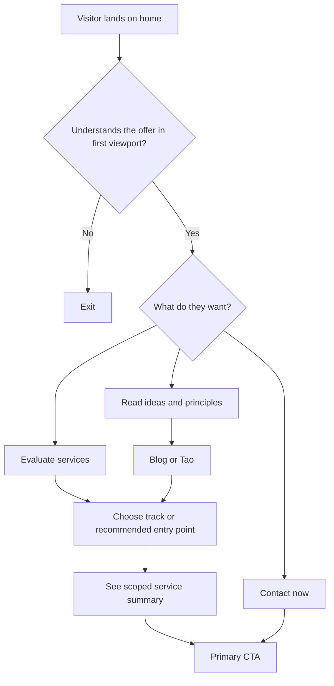

# refactor: Remediate marketing site design and UX

## Overview

This plan remediates the highest-severity issues found in the March 24, 2026 live review of `https://agentura.pages.dev/`: weak mobile first impression, overloaded services information architecture, generic CTA strategy, repeated page compositions, hidden mobile wayfinding, and incomplete publishing polish.

The goal is not a full rebrand. The site already has a credible editorial identity. The goal is to preserve that tone while making the site clearer, more distinctive page-to-page, easier to navigate on mobile, and easier to act on.



## Problem Statement

The current site communicates intelligence and taste, but it asks too much reading effort from first-time visitors and does not sequence information in the order users need it.

The most important issues are:

- On mobile, the home page intentionally moves the anti-positioning aside above the actual value proposition, weakening first-screen comprehension and pushing the CTA down.
- The services page behaves like a reference document rather than a decision-making surface. It is dense, long, and gives every service nearly identical visual weight.
- All primary pages resolve to the same generic email CTA, which is too weak for a high-trust consulting offer.
- The design system is coherent but over-reused. Multiple routes share nearly the same cover composition, ornament treatment, and rhythm, which reduces originality at the site level.
- Mobile navigation hides wayfinding and the strongest CTA at the breakpoint where clarity is already weakest.
- Technical polish is incomplete: publishing basics such as `robots.txt` are missing or misconfigured.

## Proposed Solution

Remediate the site in five coordinated layers:

1. Re-sequence the funnel so the home page presents promise, proof, choice, and CTA in that order, especially on mobile.
2. Rebuild services around decision-first navigation and summary-first content, while preserving the long-form depth lower on the page.
3. Introduce route-aware CTA architecture so each page has a stronger, more specific next step.
4. Differentiate page archetypes so home, services, Tao, blog, and article pages feel like members of one system rather than repetitions of one layout.
5. Close craft and publishing gaps, including contrast tuning, no-JS/mobile nav resilience, and static asset polish.

## Research Summary

### Technology & Infrastructure

- Astro 6 static site with Cloudflare deployment configuration in `astro.config.mjs` and `wrangler.jsonc`
- Small single-site repository with page-local Astro components and content/data files
- No monorepo structure, no backend app layer, no persistence layer, and no existing test suite
- Shared shell and design tokens live in `src/layouts/Layout.astro`
- Top-level route pages:
  - `src/pages/index.astro`
  - `src/pages/services.astro`
  - `src/pages/tao.astro`
  - `src/pages/blog/index.astro`
  - `src/pages/blog/[slug].astro`

### Architecture & Structure

- Shared navigation and CTA are implemented once and reused across all top-level pages:
  - `src/components/Nav.astro`
  - `src/components/CTA.astro`
- The home page is largely hand-composed with page-local sections and styles in `src/pages/index.astro`
- The services page is data-driven via `src/data/services.ts` and rendered through `src/components/ServiceCard.astro`
- Tao and blog pages are compositionally simpler and closer to editorial reading experiences
- The global layout provides tokens, background texture, and scroll-reveal behavior in `src/layouts/Layout.astro`

### Implementation Patterns

- Page styles are colocated with each Astro route rather than extracted into a design system directory
- Repeated page conventions:
  - warm off-white background
  - serif headline + mono micro-label
  - ornamental rules and dots
  - bordered white cards
  - large vertical cover sections
- Services content is intentionally long-form and uses repeated blocks:
  - `The situation`
  - `What we do`
  - `What you receive`
  - details grid
  - optional Tao quote
  - optional connector
- There is no evidence/proof module, no structured lead intake surface, and no route-specific CTA variant system

### Institutional Learnings

- No `docs/solutions/` directory exists in this repository
- No `docs/brainstorms/` directory exists in this repository
- This plan is therefore grounded in the live site review plus direct repo inspection

### Verification Baseline

- `npm run build` succeeds locally on March 24, 2026
- `https://agentura.pages.dev/robots.txt` currently resolves to homepage HTML instead of a valid robots file

## User Flow Gaps Identified

### Critical

1. **Mobile first-screen comprehension gap**
   - Current mobile CSS moves the hero aside above the primary message
   - Users see what the company is not selling before they understand what it does
   - The primary CTA is not visible in the first viewport on phone-sized screens

2. **Services decision gap**
   - A user arriving on `/services` must process a long anchor index and then nine similarly weighted service essays
   - The page does not clearly answer:
     - "Which path is mine?"
     - "What should I start with?"
     - "What is the smallest next step?"

3. **Conversion gap**
   - A user who becomes interested still only gets a generic `mailto:` CTA
   - The site offers no structured next step, no sample deliverable, and no decision aid

### Important

4. **Page-archetype sameness**
   - Home, services, Tao, and blog reuse too many of the same compositional moves
   - Consistency is good, but the lack of page-role differentiation makes the site feel flatter than the content deserves

5. **Mobile wayfinding gap**
   - Mobile users lose both navigation context and the strongest CTA inside the hamburger state
   - If JavaScript fails, mobile navigation is especially fragile because the menu relies on script-driven class toggling

### Minor

6. **Publishing polish gap**
   - Missing real `robots.txt`
   - README still reflects Astro starter text rather than this project

## Technical Approach

### Architecture

Preserve the existing Astro static-site model and current voice. Do not introduce a CMS or large framework migration. Keep the palette and typography family, but restructure the page system so route roles are explicit.

The remediation should introduce a small shared marketing-site layer:

- **Page archetype primitives**
  - `HomeHero`
  - `DecisionBand` or `TrackChooser`
  - `ProofStrip`
  - `RouteCTA`
  - `PageHero` variants for editorial vs commercial surfaces
- **CTA variants**
  - contact-now
  - book-readiness-assessment
  - review-services
  - read-sample-artifact
- **Content hierarchy rules**
  - promise before anti-positioning
  - summary before essay
  - proof before philosophy
  - visible CTA before long scroll

### Design System Direction

Keep:

- warm paper-like palette
- serif + mono pairing
- restrained editorial mood
- anti-hype positioning

Change:

- reduce ornamental repetition
- reduce full-screen cover reuse
- tune muted text and faint borders for better signal
- vary page compositions by route role
- use stronger proof and decision modules

### Route-by-Route Plan

#### Home (`src/pages/index.astro`)

- Keep the core positioning statement
- Remove the mobile reordering that puts the aside first
- Shorten the supporting copy in the hero
- Ensure the first viewport contains:
  - brand
  - value proposition
  - one strong primary CTA
  - one secondary CTA
- Move anti-positioning content below the hero or convert it into a secondary proof/contrast card
- Add a proof band after the hero with 3 concise evidence items such as:
  - who this is for
  - what artifact you receive
  - how engagement starts
- Keep the track overview, but make the cards more scannable and more clearly different from one another

#### Services (`src/pages/services.astro`, `src/components/ServiceCard.astro`, `src/data/services.ts`)

- Replace the anchor-index-first cover with a decision-first top section
- Introduce a chooser that answers:
  - "I am exploring"
  - "We already have agent work in production"
  - "We are a product team going agent-ready"
  - "We are a small business"
- Make the readiness assessment the clearly recommended entry point
- Convert service presentation to summary-first, depth-second
  - summary card at top of each service
  - optional long-form details below or behind progressive disclosure
- Reduce repeated label blocks where they create rhythm fatigue
- Preserve the long-form content, but stop making the user read it to orient themselves

#### Tao (`src/pages/tao.astro`)

- Keep the manifesto tone
- Reduce the amount of full-height ceremonial cover treatment if it delays reading too much on mobile
- Add a clearer re-entry to the commercial path near the top or after the first section
- Make sure Tao feels more like a manifesto and less like another marketing landing page cover

#### Blog (`src/pages/blog/index.astro`, `src/pages/blog/[slug].astro`)

- Keep the current card archive; it is the strongest current pattern
- Add stronger re-entry from blog/article pages into commercial surfaces
- Avoid adding too many decorative treatments that make blog pages feel visually identical to service pages

### Navigation and CTA Architecture

#### Navigation

- Keep a visible primary CTA on mobile outside the hidden menu state
- Consider a no-JS-resilient menu pattern if feasible within scope
- Ensure hash-link and route-link behavior remains predictable across breakpoints

#### CTA

- Replace the single generic email CTA with route-specific CTA variants
- Keep `mailto:` as a fallback, not the only action
- Preferred CTA hierarchy:
  - Home: book/readiness-assessment CTA
  - Services: start-with-assessment CTA
  - Tao/blog: review-services CTA plus contact fallback

If no scheduling tool or form endpoint is available, implement a structured contact page or structured mailto fallback with explicit prompt copy rather than a bare email address button.

### Technical and Publishing Polish

- Add `public/robots.txt`
- Consider `public/sitemap.xml` if not generated elsewhere
- Update `README.md` so it documents this project rather than the Astro starter
- Audit metadata and route descriptions while touching shared layout
- Review reduced-motion behavior and whether heavy reveal animations belong on dense content pages

## Implementation Phases

### Phase 1: IA and component foundation

**Goal:** lock the new hierarchy before rewriting large amounts of UI copy or layout.

Tasks and deliverables:

- Define target user intents and primary funnel states
- Document the new page roles:
  - home = promise + proof + choice
  - services = decision + summary + depth
  - Tao = manifesto + trust
  - blog = editorial archive + re-entry
- Refactor shared CTA API in `src/components/CTA.astro`
- Refactor shared nav behavior in `src/components/Nav.astro`
- Add any new shared primitives needed for proof/decision sections

Success criteria:

- Shared component API supports route-specific CTA behavior
- Home/services pages have approved content hierarchy before deeper implementation begins

Estimated effort:

- 0.5 to 1 day

### Phase 2: Home page remediation and mobile-first conversion

**Goal:** fix the worst first-impression and mobile issues.

Tasks and deliverables:

- Remove `.hero-aside { order: -1; }` behavior from `src/pages/index.astro`
- Rework hero copy structure so the first viewport carries the core pitch and CTA
- Move or redesign the anti-positioning card
- Add proof/evidence band after the hero
- Ensure mobile CTA visibility without opening nav
- Tighten muted text and spacing where the first screen feels delicate rather than decisive

Success criteria:

- On `390x844`, first viewport shows value proposition and primary CTA
- Anti-positioning content no longer precedes the offer on mobile
- Home page feels clearer without becoming generic

Estimated effort:

- 1 to 1.5 days

### Phase 3: Services page redesign

**Goal:** turn `/services` from a document into a decision surface.

Tasks and deliverables:

- Replace the current cover anchor index in `src/pages/services.astro`
- Add a track chooser or recommended starting path
- Reformat service sections in `src/components/ServiceCard.astro` to be summary-first
- Introduce stronger visual distinction between:
  - entry point
  - Track I
  - Track II
  - Track III
- Add route-specific CTA blocks at sensible intervals instead of only at the end
- Preserve detailed copy as secondary depth, not primary orientation

Success criteria:

- A visitor can identify their likely starting track before the first long-scroll section
- Readiness assessment is clearly the default starting point
- Services page no longer requires full-page reading to understand the offer structure

Estimated effort:

- 2 to 3 days

### Phase 4: Supporting page differentiation

**Goal:** make page types feel intentionally different while staying in one brand system.

Tasks and deliverables:

- Adjust `src/pages/tao.astro` so it reads as a manifesto, not another landing-page cover
- Keep `src/pages/blog/index.astro` close to its current card-based structure, but strengthen commercial re-entry
- Review `src/pages/blog/[slug].astro` for CTA placement after articles
- Reduce repeated ornament and cover treatments across non-home routes

Success criteria:

- Home, services, Tao, and blog are recognizably related but not visually interchangeable

Estimated effort:

- 1 to 1.5 days

### Phase 5: Technical polish and verification

**Goal:** close craft and deployment gaps and ship with confidence.

Tasks and deliverables:

- Add `public/robots.txt`
- Add or confirm sitemap handling
- Update `README.md`
- Run contrast and typography review across desktop and mobile
- Validate no-JS behavior as far as practical for mobile nav and core wayfinding
- Run final route-by-route screenshot and build verification

Success criteria:

- `robots.txt` returns valid text
- build passes
- mobile and desktop review show no regressions in primary flows

Estimated effort:

- 0.5 to 1 day

## Alternative Approaches Considered

### 1. Minimal patch set only

Examples:

- remove mobile hero reorder
- add a stronger CTA
- keep services structure largely intact

Why rejected:

- It would improve symptoms but leave the core decision-making and originality problems intact
- The services page would still be document-first

### 2. Full rebrand / visual reinvention

Why rejected:

- The underlying taste is already credible
- The strongest value is in preserving the anti-hype editorial identity while improving clarity and conversion

### 3. CMS-driven or framework-heavy rebuild

Why rejected:

- The repo is small and static
- The current architecture is sufficient for the remediation scope
- The leverage is in information architecture and composition, not tooling expansion

## System-Wide Impact

### Interaction Graph

- `src/layouts/Layout.astro` affects all routes through global tokens and reveal behavior
- `src/components/Nav.astro` affects all top-level routes and all mobile entry flows
- `src/components/CTA.astro` affects all commercial exits from home, services, blog, and possibly Tao
- `src/data/services.ts` feeds `src/pages/index.astro` and `src/pages/services.astro`
- `src/components/ServiceCard.astro` controls the repetition, density, and scannability of all service bodies

Action X triggers Y, which affects Z:

- updating CTA API changes home, services, blog, and future article CTA behavior
- updating nav/mobile behavior changes every route's first-screen usability
- changing services data shape may require coordinated changes in both `src/pages/services.astro` and `src/pages/index.astro`

### Error & Failure Propagation

- This is a static Astro site, so most failures surface at build time or in client-side interaction
- Highest-risk regression zones:
  - broken anchor links on `/services`
  - broken CTA destinations
  - mobile nav state bugs
  - hidden or duplicated hero content at responsive breakpoints
  - content/data mismatches if service summaries and full details diverge

### State Lifecycle Risks

- No persistent backend state is involved
- Main "state" risks are UI state and navigation state:
  - mobile menu open/close behavior
  - anchor navigation to track/service sections
  - route-specific CTA logic
  - reveal animation timing on dense pages

### API Surface Parity

Interfaces that need coordinated updates:

- `src/components/Nav.astro`
- `src/components/CTA.astro`
- `src/layouts/Layout.astro`
- `src/pages/index.astro`
- `src/pages/services.astro`
- `src/pages/tao.astro`
- `src/pages/blog/index.astro`
- `src/pages/blog/[slug].astro`
- `src/components/ServiceCard.astro`
- `src/data/services.ts`

### Integration Test Scenarios

1. **Mobile home first impression**
   - Load `/` at `390x844`
   - Verify brand, core promise, and primary CTA are visible without scrolling

2. **Commercial path selection**
   - Load `/services`
   - Verify user can identify a recommended starting path before reading long-form details

3. **Editorial-to-commercial re-entry**
   - Load a blog post and `/tao`
   - Verify users can reach services/contact without hunting

4. **Mobile nav and CTA parity**
   - Verify the strongest CTA remains visible or easily reachable on mobile
   - Verify menu behavior does not trap or confuse users

5. **Publishing sanity**
   - Verify `npm run build`
   - Verify `robots.txt`
   - Verify route metadata still renders correctly

## Acceptance Criteria

### Functional Requirements

- [x] On mobile, the home page first viewport shows the brand, the core value proposition, and a primary CTA without scrolling
- [x] The anti-positioning aside no longer appears before the main value proposition on mobile
- [x] The services page provides a clear, summary-first decision path before the detailed service essays
- [x] The readiness assessment is visibly framed as the default starting point for uncertain buyers
- [x] Every top-level route has a route-appropriate CTA, not just the same generic email button
- [x] Mobile navigation preserves wayfinding and does not hide the strongest CTA entirely
- [x] Tao and blog routes provide clear re-entry into the commercial path
- [x] `robots.txt` is present and returns valid text content

### Non-Functional Requirements

- [x] Preserve the current editorial brand direction rather than replacing it with generic SaaS patterns
- [x] Maintain Astro static output and existing Cloudflare deployment model
- [x] Improve contrast/signal for muted text and delicate UI elements where needed
- [x] Respect reduced-motion behavior and avoid animation overuse on dense reading pages
- [x] Keep top-level route performance in line with current static-site expectations

### Quality Gates

- [x] `npm run build` passes
- [x] Manual review completed on:
  - [x] `/`
  - [x] `/services`
  - [x] `/tao`
  - [x] `/blog`
  - [x] one blog article route
- [x] Desktop and mobile screenshots reviewed for the above routes
- [x] CTA destinations and anchor links verified
- [x] `robots.txt` and any sitemap output verified after build/publish

## Success Metrics

Primary success metrics:

- Home mobile first viewport contains the value proposition and CTA
- Services page presents a decision point before deep content
- At least three distinct page archetypes are visible across home, services, and editorial surfaces
- Publishing polish issues found in the live review are closed

Secondary success metrics:

- The number of scroll-heavy sections required before a user sees a meaningful CTA decreases
- The site feels more intentional and less repetitive without losing its current voice

If analytics are available later, measure:

- CTA click-through rate by route
- bounce rate on home and services
- scroll depth on services before first CTA interaction

## Dependencies & Prerequisites

- Confirm the preferred primary CTA destination:
  - scheduling tool
  - contact form
  - structured mailto fallback
- Confirm whether proof artifacts exist:
  - sample deliverables
  - client outcomes
  - engagement process assets
- Confirm how much copy rewriting is acceptable versus layout-only remediation

Working assumptions if unanswered:

- Significant copy tightening is allowed
- No CMS migration is desired
- A structured CTA surface is preferred over bare `mailto:`

## Risk Analysis & Mitigation

### Risk: Over-correct into generic B2B SaaS design

Mitigation:

- preserve palette, typography, and editorial restraint
- add proof and clarity without defaulting to trend-heavy UI tropes

### Risk: Services rewrite drops important nuance

Mitigation:

- use summary-first plus progressive disclosure, not summary-only
- preserve the detailed service essays lower on the page

### Risk: Shared component refactor makes pages even more uniform

Mitigation:

- create route-specific variants and page-role rules
- do not force a single hero treatment everywhere

### Risk: CTA improvements depend on tooling not currently available

Mitigation:

- design the CTA component to support multiple destinations
- fall back to structured contact intent if scheduling/form tooling is unavailable

### Risk: Mobile nav remains JS-fragile

Mitigation:

- review graceful fallback behavior during implementation
- keep a visible CTA outside the hidden menu state

## Resource Requirements

- 1 frontend implementer comfortable with Astro and CSS refinement
- 1 content/design reviewer for hierarchy and copy approval
- Optional founder/stakeholder review for offer language and CTA wording

Estimated total effort:

- 5 to 8 focused implementation days

## Future Considerations

- Add case studies or proof artifacts once available
- Add lightweight analytics for CTA and route performance
- Consider social metadata / OG image polish if the site is being used for broader distribution
- Revisit CMS or content ops tooling only if content volume materially increases

## Documentation Plan

- Update `README.md` to describe the actual project and validation commands
- If new shared page primitives are introduced, add a short internal note such as `docs/site-design-decisions.md` covering:
  - page archetypes
  - CTA variants
  - component ownership
  - responsive rules that must not regress

## Sources & References

### Internal References

- `src/layouts/Layout.astro`
- `src/components/Nav.astro`
- `src/components/CTA.astro`
- `src/pages/index.astro`
- `src/pages/services.astro`
- `src/pages/tao.astro`
- `src/pages/blog/index.astro`
- `src/pages/blog/[slug].astro`
- `src/components/ServiceCard.astro`
- `src/data/services.ts`

### Live Review References

- `https://agentura.pages.dev/`
- `https://agentura.pages.dev/services`
- `https://agentura.pages.dev/tao`
- `https://agentura.pages.dev/blog`
- `https://agentura.pages.dev/blog/the-crystallization-function`
- `https://agentura.pages.dev/robots.txt`

### Validation Commands

```bash
npm run build
```

## Recommended Next Steps

1. Approve the IA direction before implementation starts.
2. Implement Phase 1 and Phase 2 together so the biggest mobile and CTA issues are fixed first.
3. Treat the services page redesign as the central workstream; it carries the highest information architecture payoff.
4. Reserve final time for screenshot-based review across desktop and mobile, not just local code review.
